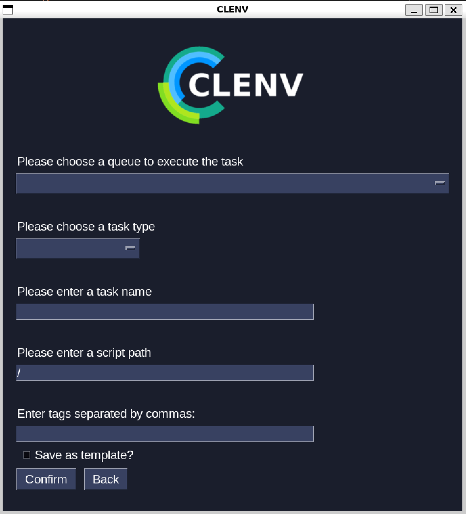
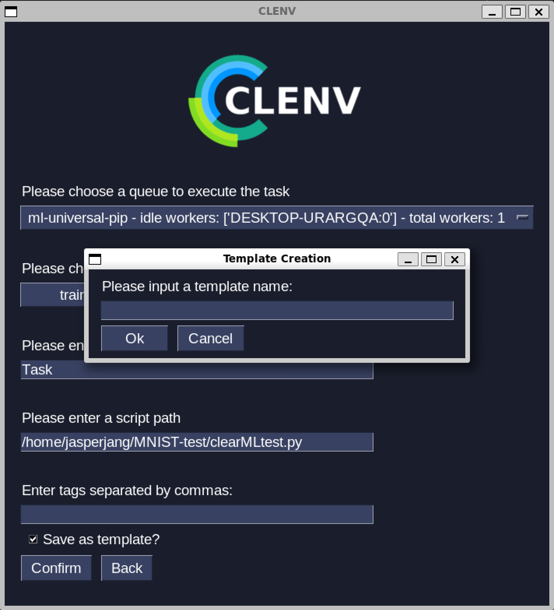
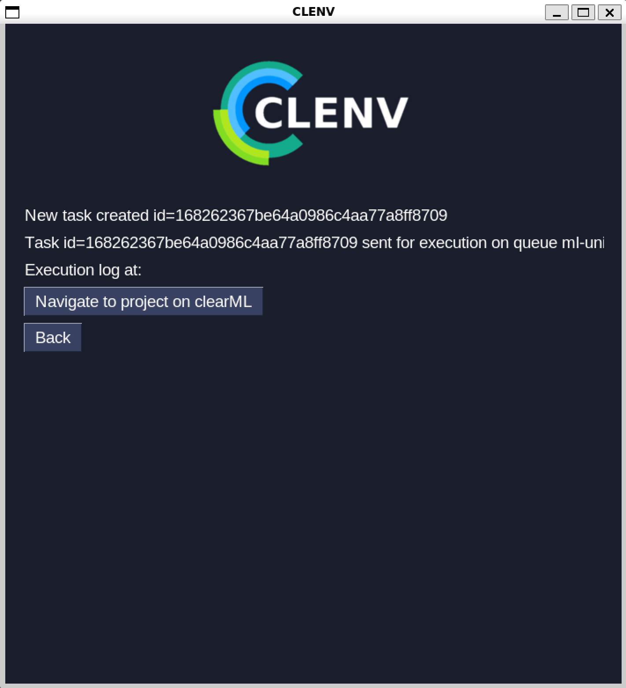
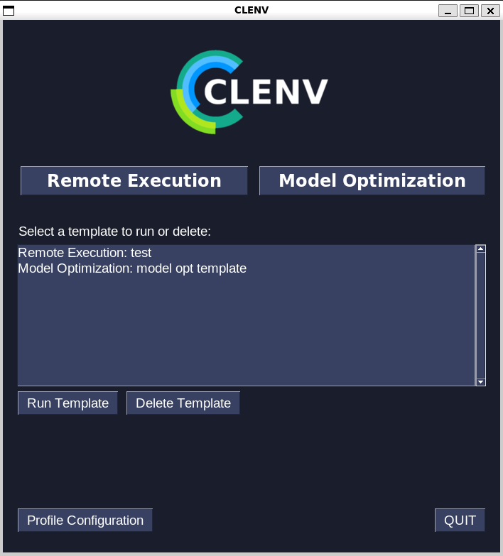
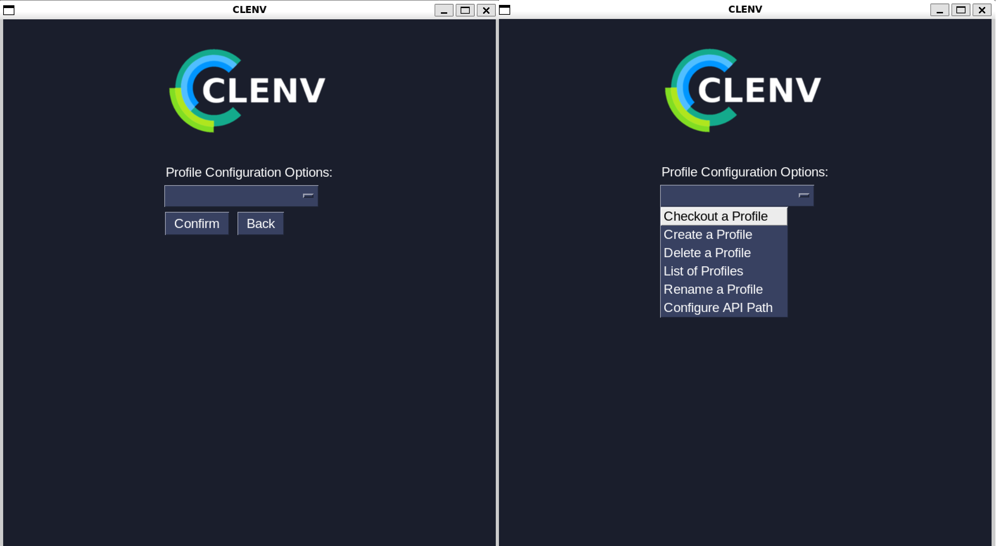
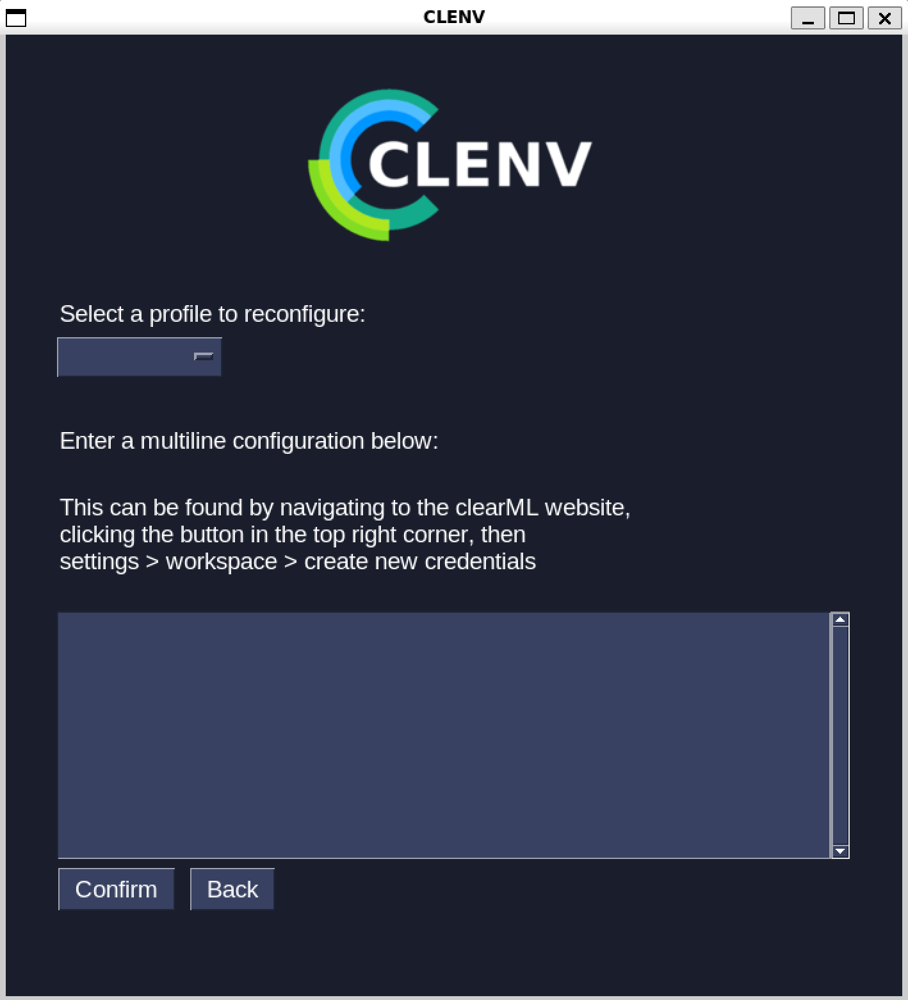
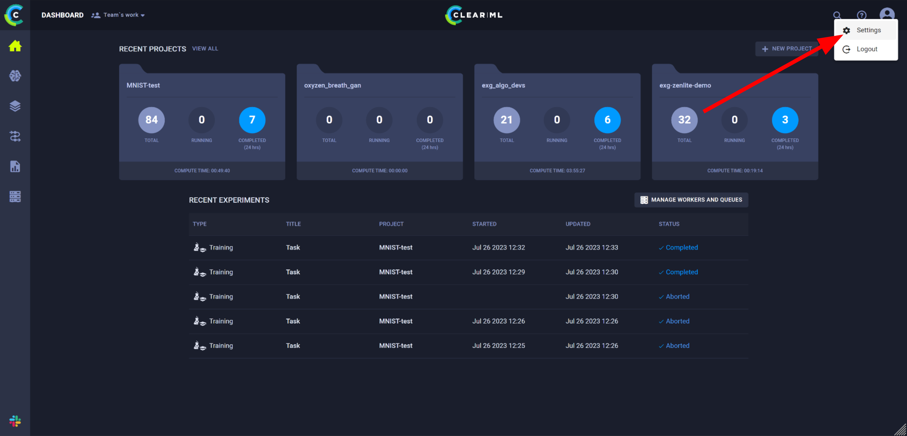
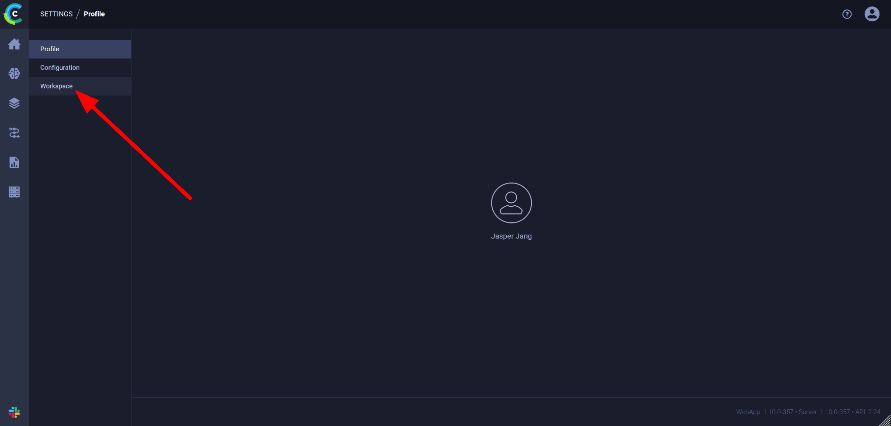
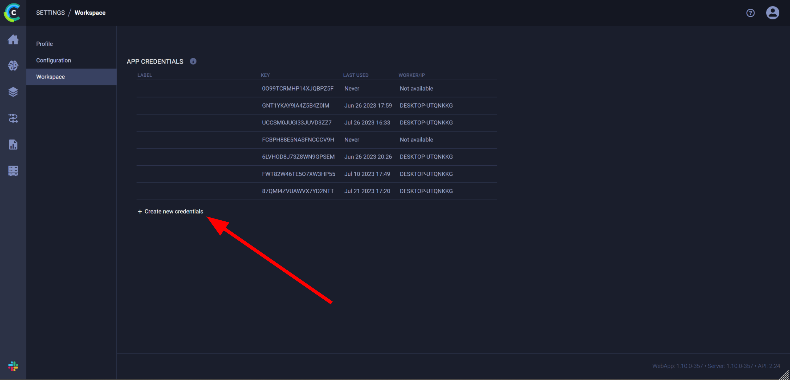
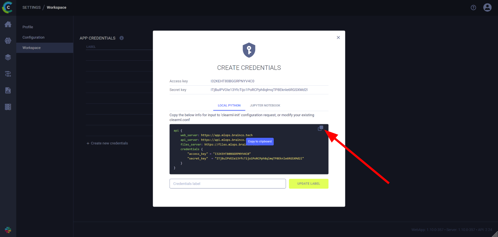

How to use clenv GUI
====================
Executing tasks
---------------

The home screen of the GUI:

.. image:: images/main.png
    :scale: 30 %

When you first open the app, you won't have any saved templates, so to run a new 
task click "Run New". You chould be brought to the following screen:

Use the dropdown menus to select the queue and task type, then type the task 
name, *absolute* script path, and any tags you want to include. If you would 
like to save this configuration, check the "Save as template" box before 
clicking confirm. 

If you checked the box, you will prompted to enter a template name:

Once you confirm, you will be brough to the task executed screen:

If you click the "Navigate to project on clearML" button, your default web 
browser will open the task on the clearML website.

If you chose to save the configuration as a template, it will be visible on the 
home screen:

To run the template, click on the template, then click "Run Template".

To delete the template, click on the template, then click "Delete Template"

Profile Configuration
---------------------

Clicking the "Profile Configuration" button on the home screen will bring you to 
the profile configuration screen.

To configure something, click the dropdown menu, select an option, and confirm.

Profiles are a way to easily switch between different clearML accounts.  For 
example, I may have one profile that is connected to my BrainCo clearML account 
and one profile that is connected to my personal clearML account. By default, 
your starting profile will be connected to the account you used to setup clearML 
on your device, but you can change the credentials of a profile by selecting the 
"Configure API Path" option, which will bring you to the following screen:

To find the multiline configuration to paste into the box, follow these steps:

1. In the web browser of your choice, login to the clearML website with the 
account you would like to use in clenvGUI. Click the icon in the top right and 
then "settings":

2. Click on the "workspace" option on the left:

3. Click on "Create new credentials":

4. Copy the multiline config in the popup and paste it into clenvGUI:

