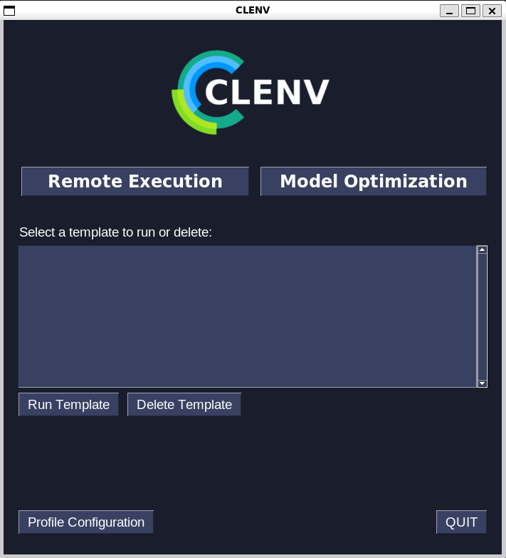

How To Use Clenv GUI
====================

Here is a `video demo`_ of all the features of the program.

.. _video demo: https://youtu.be/H7ENmoxbXjs?feature=shared

The home screen of the GUI:

When you first open the app, you won't have any saved templates, so you will 
have the option to to run an experiment remotely or optimize an existing model.

Executing Tasks Remotely
------------------------

If you select the "Remote Execution" button you will be brought to the following
screen.

.. image:: images/task_exec_blank.png
    :scale: 30 %

Use the dropdown menus to select the queue and task type, then type the task 
name, *absolute* script path, and any tags you want to include. If you would 
like to save this configuration, check the "Save as template" box before 
clicking confirm. 

If you checked the box, you will prompted to enter a template name:

Once you confirm, you will be brought to the task executed screen:

If you click the "Navigate to project on clearML" button, your default web 
browser will open the task on the clearML website.

If you chose to save the configuration as a template, it will be visible on the 
home screen:

To run the template, click on the template, then click "Run Template".

To delete the template, click on the template, then click "Delete Template"

Model Optimization
------------------

If you select the "Model Optimization" button you will be brought to the 
following screen.

Use the dropdown menus to select the queue that will host the optimization task 
itself, then enter a task name for the optimizer and the name of the project 
you would like the optimization task to be placed in.

Next enter the task name and project name of a ClearML experiment in which the 
model you would like to optimize has been trained.

Once you click the "Confirm" you will be brought to the following screen:

The information you entered in the first step will be displayed at the top of 
screen. The menus below this information are divided into three columns.

The first column contains all the numerical hyperparameters tracked by ClearML. 
For as many parameters as you would like to optimize, enter a minimum value, 
maximum value, and step size. Decimal values will only be accepted for the 
parameters with (FLOAT) displayed.

The second column contains all the discrete hyperparameters tracked by ClearML. 
For as many parameters as you would like to optimize, enter string or boolean 
values separated by commas **with no space after** i.e. "true,false" will work 
but "true, false" will not.

The third column contains the parameters for the optimization process that are 
independent of the detected hyperparameters of the model. 

Here is a more detailed explenation of each of the default parameters that must 
be filled out (required):
* First select a queue in which the optimization child tasks will be run. If the 
queue you selected for the optimization task in the first step (visible in the 
top right) is only able to run one task at a time, you must select a seperate 
queue for the child tasks to be run.
* Next select on the of the detected metrics to optimize and also whether you 
like to minimize or maximize the metric. For example, if one choses to optimize 
loss they ought to minimize it but if one chooses to optimize accuracy they 
ought to maximize it.
* The next option is the maximum number of concurrent child tasks created from 
the optimization task at a time. Consider the number of workers on the child 
task queue when choosing this value.
* The time interval to check on the experiments is the time interval in which a 
status report on the optimization process shows up in the optimizer's terminal.

Here is an example of a completed hyperparameter optimization screen that is 
ready to be executed:

If you would like to save this configuration, check the "Save as template" box 
before clicking confirm. 

If you checked the box, you will prompted to enter a template name.

Once you confirm, you will be brought to the task executed screen.

If you click the "Navigate to project on clearML" button, your default web 
browser will open the task on the clearML website.

If you chose to save the configuration as a template, it will be visible on the 
home screen:

To run the template, click on the template, then click "Run Template". This will 
the initial model optimization screen and you will directly enter the 
hyperparameter screen.

Profile Configuration
---------------------

Clicking the "Profile Configuration" button on the bottom left of the home 
screen will bring you to the profile configuration screen.

To configure something, click the dropdown menu, select an option, and confirm.

Profiles are a way to easily switch between different clearML accounts.  For 
example, I may have one profile that is connected to my BrainCo clearML account 
and one profile that is connected to my personal clearML account. By default, 
your starting profile will be connected to the account you used to setup clearML 
on your device, but you can change the credentials of a profile by selecting the 
"Configure API Path" option, which will bring you to the following screen:

To find the multiline configuration to paste into the box, follow these steps:

1. In the web browser of your choice, login to the clearML website with the 
account you would like to use in clenvGUI. Click the icon in the top right and 
then "settings":

2. Click on the "workspace" option on the left:

3. Click on "Create new credentials":

.. image:: images/clearML3.png
    :scale: 20 %

4. Copy the multiline config in the popup and paste it into clenvGUI:

.. image:: images/clearML4.png
    :scale: 20 %